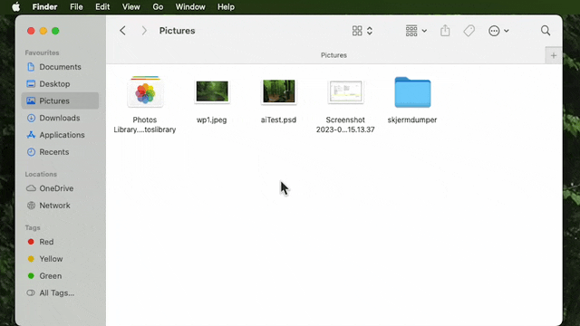
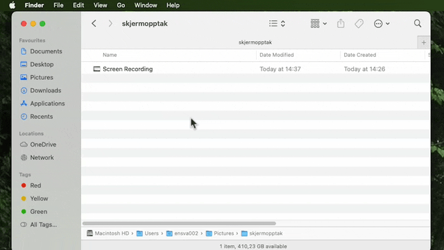
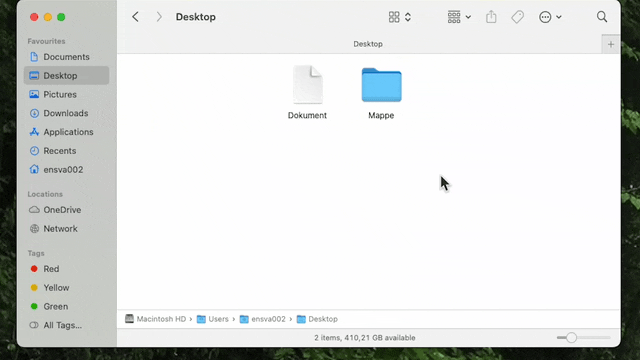
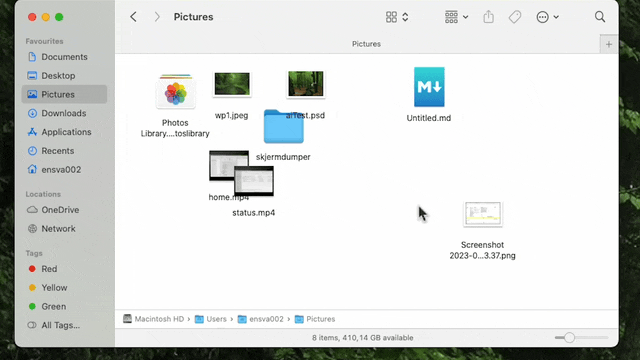
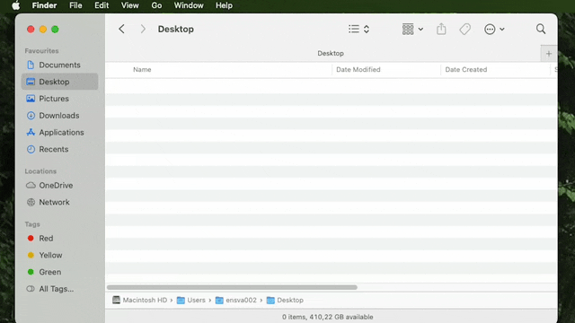

Her er noen tips og triks for å tilpasse Finder for en mer effektiv hverdag. 🙂

Path Bar viser deg hele filstien til mappen du er i, og lar deg lett gå tilbake til en mappe høyere opp i hierarkiet
*View>Show Path Bar*

Status Bar viser deg hvor mange elementer mappen du er i inneholder, hvor mange elementer du har valgt, og hvor mye lagringsplass du har igjen. Kjekk å ha om du jobber med store filer.
*View>Show Status Bar*

Gå til *Finder>Settings>Advanced* for å slå på filending (filename extensions) for alle filer. Når du skal referere til en fil i koden din trenger du å vite hele navnet på filen, inkludert filendingen.

Trykk på  `Shift ⇧`  +  `Command ⌘`  +  `Punktum .`  for å vise eller skjule skjulte filer. Du kan også lage skjulte filer ved å gi filen et navn som starter med punktum. Finder vil kun la deg lage skjulte filer når skjulte filer er synlige.

Bruk denne knappen for å forandre mappe-visning. Rotete mapper er lite effektivt å jobbe med 😉

I *Finder>Settings>Sidebar*kan du legge til eller fjerne elementer fra Sidebar. Det kan for eksempel være praktisk å legge til *Home* (brukernavnet ditt).

