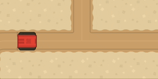
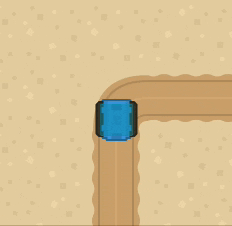
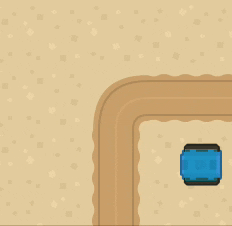
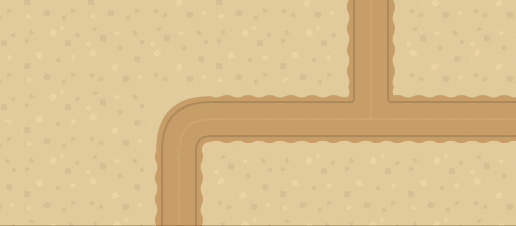

*I dette eksempelet bruker vi [Kenney top-down tanks](https://www.kenney.nl/assets/top-down-tanks-redux) asset pakken.*

Så lenge karakteren vår er en CharacterBody2D, så er alt vi trenger for å bevege den å sette velocity og bruke move_and_slide() i _physics_process(delta) funksjonen. 

```gdscript
extends CharacterBody2D

func _physics_process(delta):
  velocity.x = 300
  move_and_slide()
```
	


Her setter vi retning bassert på piltaster. vi putter det i en Vector2 variabel, den defineres som tom hver gang i starten av funksjonen, slik at karakteren stopper om vi ikke holder inne en tast. til slutt ganger vi retning med fart og gir resultatet til velocity.

```gdscript
velocity = Vector2(move_direction * speed)
```
er det samme som:
```gdscript
velocity.x = move_direction.x * speed
velocity.y = move_direction.y * speed
```
---

```gdscript

var speed = 200
func _physics_process(delta):
  var move_direction = Vector2.ZERO
  
  if Input.is_action_pressed("ui_right"):
    move_direction.x = 1
  elif Input.is_action_pressed("ui_left"):
    move_direction.x = -1
  elif Input.is_action_pressed("ui_down"):
    move_direction.y = 1
  elif Input.is_action_pressed("ui_up"):
    move_direction.y = -1
  
  velocity = Vector2(move_direction * speed)
  move_and_slide()

```
	


I neste eksempel har jeg byttet ut `velocity = Vector2(move_direction * speed)` med kode som bruker move_toward(A,B,C).  

Move toward flytter et objekt gradvis mot et punkt.  

A: punktet den flytter seg fra  

B: punktet den skal til  

C: akselrasjon og brems (ease out/in)  

Om vi og legger til kode som roterer grafikken får vi en ganske naturlig bevegelse.

```gdscript
velocity.x = move_toward(velocity.x, move_direction.x * speed, 5)
velocity.y = move_toward(velocity.y, move_direction.y * speed, 5)
```


om vi ønsker at bilen skal kunne gå diagonalt må vi bare bytte ut elif på linje 10 med if. i forrige eksempel. Det gjør at vi kan ta i mot både vertikal og horisontalt input på samme frame.


